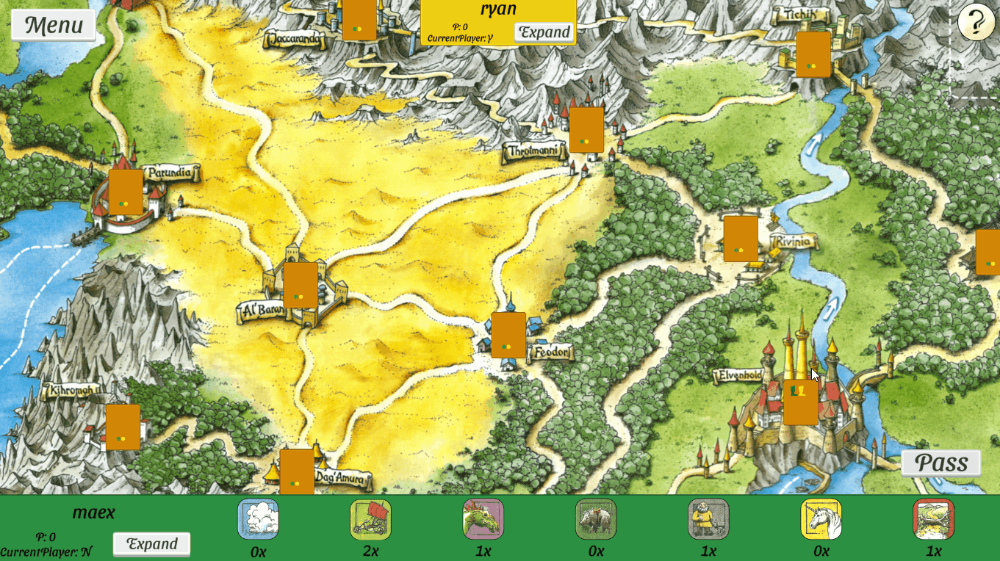
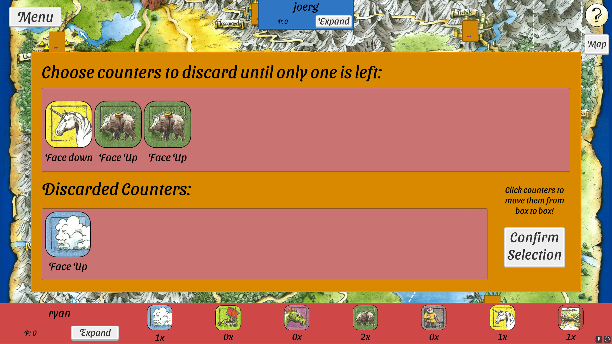
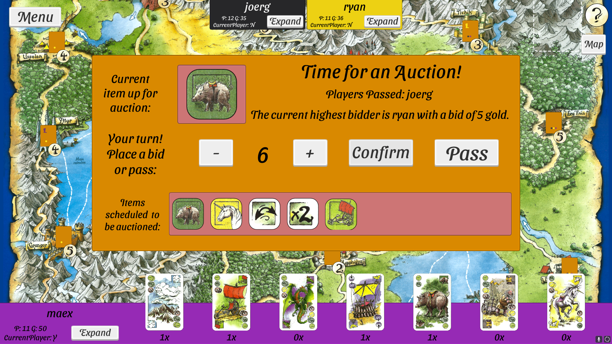
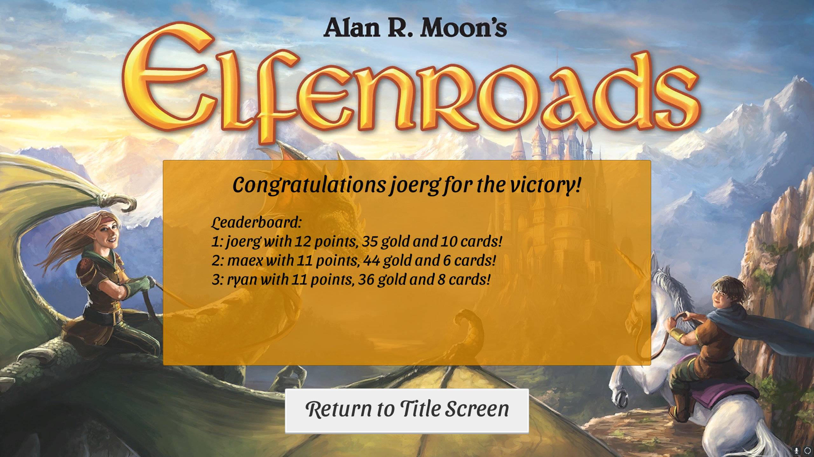

# COMP361 ElfenRoads Project
This project was built during McGill University's 2021-2022 [COMP361 class](https://www.mcgill.ca/study/2022-2023/courses/comp-361d1), where over the course of two semesters our aim was to create an online multiplayer version of Alan R. Moon's popular board game "ElfenLand", including its expansion "ElfenGold" as well as their variants (This version of the game is often shortened to ElfenRoads, more info on the game can be found [here](https://boardgamegeek.com/boardgame/180325/elfenroads)). 
## Installation
This project was made using Unity version 2020.3.21f1 LTS (64-bit). Select `Elfenroads` as the project root during import, and build/run it as you would any other unity project.
## Contributors
The following seven students participated in the creation of this project:
- [Maxim Boucher](https://github.com/MaxBouch14)
- [Adja Coulibaly](https://github.com/adjabeepboop)
- [Christopher Cui](https://github.com/chriscui47)
- [Xiang Meng](https://github.com/xm2j)
- [Danial Motamedi Mehr](https://github.com/danial23)
- [Alex Rojco](https://github.com/alexrojco)
- [Luis Yoon](https://github.com/Luisy619)

## Features

### Lobby

A session-creation system and API used in this project was provided to the students by the teachers. This "LobbyService" can be found [here](https://github.com/kartoffelquadrat/LobbyService). It allows for quick creation of game sessions (in the case of this game, for up to six players) as well as game-save functionality. Below is a short demo of what launching a game of Elfenroads could look like:

### Gameplay
The game UI is very intuitive, allowing various complicated actions to be done seamlessly and in quick succession. Shown below is an example of the "Move Boot" phase with a "Elfen Witch" variant of the "ElfenGold" expansion, while moving using a Caravan on a road containing an obstacle as well as a witch's flight and movement on streams. Note that the map can be zoomed in and out, that all of these actions are sent in real-time to all player devices, and that a savegame can be created on any step through the top-left "Menu" button:

And don't worry if you don't know the game's rules (or you just need to brush up on them) - every phase of the game includes an info screen which can be accessed on the top-right of the game screen, and incorrect actions will tell you what you did wrong as shown below:

### Photo Gallery
Below are several pictures displaying the UI from various phases of a typical game of Elfenroads:

- The 'Draw Card' phase of ElfenGold:

- The 'Finish Round' phase of ElfenLand:

- The 'Auction' phase of ElfenGold:

- Finally, an example of the 'end of game' screen:

