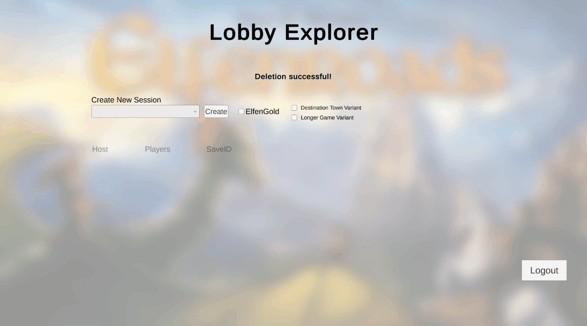

# COMP361 Elfenroads Project
This project was built during McGill University's 2021-2022 COMP361 class, where over the course of two semesters our aim was to create an online multiplayer version of Alan R. Moon's popular board game "Elfenland", including its expansion "Elfengold" as well as their variants (This version of the game is often shortened to Elfenroads, more info on the game can be found [here](https://boardgamegeek.com/boardgame/180325/elfenroads)). 
## Installation
This project was made using Unity version 2020.3.21f1 LTS (64-bit). Select `Elfenroads` as the project root during import, and build/run it as you would any other unity project.
## Contributors
The following seven students participated in the creation of this project:
- [Maxim Boucher](https://github.com/Thorzag)
- [Adja Coulibaly](https://github.com/adjabeepboop)
- [Christopher Cui](https://github.com/chriscui47)
- [Xiang Meng](https://github.com/xm2j)
- [Danial Motamedi Mehr](https://github.com/danial23)
- [Alex Rojco](https://github.com/alexrojco)
- [Luis Yoon](https://github.com/Luisy619)

## Features
###Lobby
The Lobby and matchmaking system used for this project was provided to the students by the teachers. This "LobbyService" can be found [here](https://github.com/kartoffelquadrat/LobbyService). It allows for quick creation of game sessions (in the case of this game, for up to six players) as well as game-save functionality. Below is a short demo of what launching a game of Elfenroads could look like:

